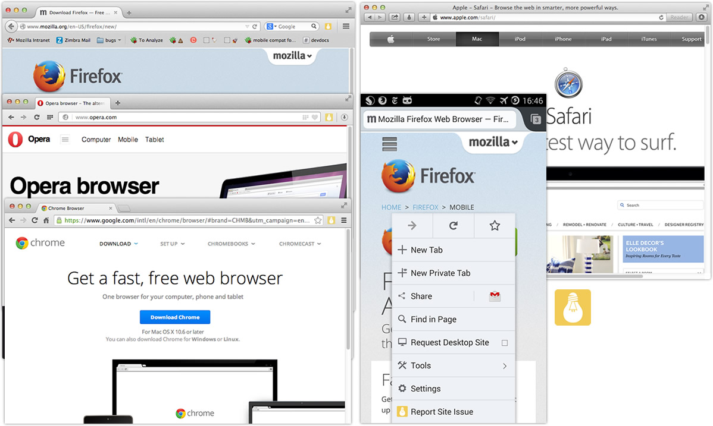

# Webcompat.com Reporter browser extensions

Browser extensions for Chrome, Firefox (29+), Opera, and Safari that allow users to click on a button in the browser chrome to report a web compatibility issue at webcompat.com.

*(If someone knows how to build something similar for Internet Explorer, file an issue and let's build it!)

### Installation

Find the packaged extension in the `bin` directory, and install in your browser (usually double-clicking or dropping into a browser window does the trick).

Links to extension sites coming soon.

### Privacy

By clicking on the extension button, the user asks the browser to send the URL of a website to webcompat.com (in order to report an issue) in a new tab. No information is collected besides that which gets submitted by the user as a bug report.

### License

This Source Code Form is subject to the terms of the Mozilla Public
License, v. 2.0. If a copy of the MPL was not distributed with this
file, You can obtain one at http://mozilla.org/MPL/2.0/.

Icons derived from work licensed under Creative Commons Attribution:

* Light Bulb by Jean-Philippe Cabaroc from The Noun Project